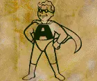
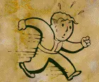
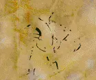
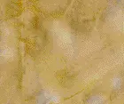
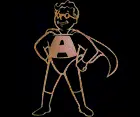
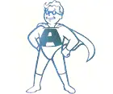
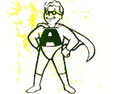
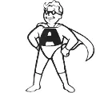

### Vault Boy Icons
After extracting the source images from the game files you can see that all the icons share the same background.
The portion of the images that we want (the line art) is consistently darker than the common background, so whe can use a composite operator called 'lighten' on all of the images to combine them all in to one and extract the common background elements.

Compose this:

With this:

Using "lighten" comoposite operator

We do that with enough images with the same background and we get:

Now we can use the "difference" operator on the composite background and one of the source images to extract out just the line art:

But whoops it's inverted, lets negate that:

Hmm, the difference extracted too much of the background from the line art, we can now use the composite background from all the images earlier to burn in the line art and restore something like the original intensity

That caused left-over artifacts, but they are can be reduced by converting to grayscale

Now we can auto-level to improve intensity

Finally we convert white levels to alpha

Now with each of these bitmaps you can submit them to https://vectorizer.ai/ in order to get a vectorized version.

You can also compress the results from Vectorizer with SVGO.

All of that is encapsulated in the fo2.js script.
